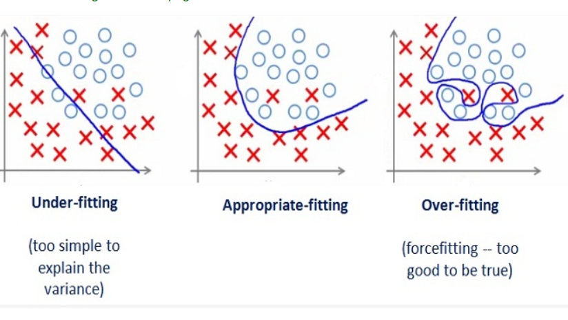

+++
title = "Overfitting"
date = 2018-09-15T22:41:26-07:00
draft = false

# Authors. Comma separated list, e.g. `["Bob Smith", "David Jones"]`.
authors = ["Alex Hope"]

# Tags and categories
# For example, use `tags = []` for no tags, or the form `tags = ["A Tag", "Another Tag"]` for one or more tags.
tags = []
categories = []

# Projects (optional).
#   Associate this post with one or more of your projects.
#   Simply enter your project's folder or file name without extension.
#   E.g. `projects = ["deep-learning"]` references
#   `content/project/deep-learning/index.md`.
#   Otherwise, set `projects = []`.
# projects = ["internal-project"]

# Featured image
# To use, add an image named `featured.jpg/png` to your page's folder.
[image]
  # Caption (optional)
  caption = "Examples of different model fits to the data"

  # Focal point (optional)
  # Options: Smart, Center, TopLeft, Top, TopRight, Left, Right, BottomLeft, Bottom, BottomRight
  focal_point = ""
+++

Blog Post- Alex Hope
## **Overfitting**

What is overfitting exactly? Why does it matter?

The truth is the word has a few definitions, and depending on who you ask and the context in which the word is used you may receive a wildly different answer. When I talk about overfitting I am not referring to when someone has outgrown their old pants or when a pipe is too large for it's receiver. I'm talking about it's use in statistics. Here, overfitting is a common pitfall in data analysis where a particular model explains observations in a dataset too precisely and confidently.

Wait though, wouldn't explaining data accurately and with confidence be a good thing?

Well yes, accurately detailing trends in a dataset is considered a good thing but if that explanation isn't useful when generalizing to other similar datasets with the same problem than the outcome isn't positive at all. Just because a model perfectly explains the information in a given dataset does not mean it's suitable to explain other observations it hasn't encountered yet and this is fundamental to why we want to build a model in the first place. One sign that your model may be overfitted to your data is when there is very low variance. In fact, if a model has been trained to predict patterns of data in an original 'training dataset' too strongly, it will struggle with making close approximations about patterns in new datasets that likely vary in all sorts of small or large ways that may or may not be interesting (natural variation vs error).

Of course, we want to build a model that accurately accounts for both present and future observations, however, if the model is overfitted to the present data than it will struggle with predicting new information that do not fit cleanly into the distribution of the original dataset it was trained on. This is a common issue and there are many ways to combat this problem, however, that goes beyond the scope of this topic.

The fact of the matter is data is very messy, and will not arrive in identically similar ways because measuring phenomena in the world is a complex and difficult endeavor. A delicate balance always needs to be struck between highlighting interesting variation in a dataset and ignoring aspects that are simply noise.
So, that was a lot of words, let's break it down visually. What are examples of different kinds of fittings?
Below you will find examples of a) under-fitting, b) appropriate fitting, and c) over-fitting that outline how different quadratic functions of models can be fitted to data. Bear in mind, not all models are made equal!

Here are examples of different "fits" on the same data:

The images above represent three examples of different functions that capture trends in a set of observations (i.e 'X' and 'O'). In each of the above pictures the aim of the model is to best capture the position of 'O' datapoints as they are distributed across the x- and y-axis. However, some capture the data better than others.
The far right image is an example of overfitting where the function has been forced to fit all of the 'O' observations and exclude all of the 'X' observations. As you can see it captures it perfectly! Butf how do you think it would hold up if a new dataset was presented on the same 2-plane axis? Probably not very well since observations tend to move at least slightly within a distribution and if any of these data points were to move in the axes, the model would hold much less predictive power. This is what is meant by picking a suitable model over a perfect model. We are interested in generalizing our predictions to other phenomena, not perfectly modeling observations that already exist.

Conversely, on the left image you have under-fitting where the model hasn't been trained adequately to grasp patterns in a dataset that are clearly meaningful signals. In those cases the predictive power of the model will be impaired as well, and so the delicate balance between both extremes leads to an appropriate fit shown in the middle. Here, you can see that the approriate fit does not capture the data perfectly, however, it does do an excellent job at explaining the general direction of the trend while leaving enough room for observations to potentially fall on either side of the quadratic function. Essentially, this model predicts the trend well but also leaves room for error within the distribution where outliers and other variables may moderate the datapoints being examined.

Why does this topic even matter?

This topic matters a ton! In the current data-driven world we inhabit, humans are increasingly relying on data to aid their decision-making across both their personal and professional lives. Making an informed decision about anything hinges on the quality of the information being received, and that starts with building effective, properly fitted models that make predictions about trends accurately. From marketing to production lines to brain-imaging to product design and consumption, analytics play a role across many facets of society. My hope is that you now understand what the term overfitting refers to in statistics, the consequences of overfitting statistical models and that you are excited to learn about it further!
